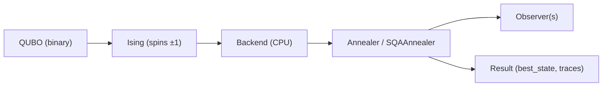

# qanneal Architecture Overview

This document explains how the core pieces fit together, how data flows, and where to look when extending the codebase.

## High-level flow

## Core components

- **Models**
- `DenseIsing`: fully connected Ising model with dense `J`.
- `SparseIsing`: sparse Ising model with edge list.
- `QUBO`: quadratic binary model with `Q`, provides `to_ising()`.

- **Schedules**
- `AnnealSchedule`: classical schedule of `betas`.
- `SQASchedule`: quantum schedule of paired `(beta, gamma)` values.

- **Annealers**
- `Annealer`: classical simulated annealing.
- `ReplicaAnnealer`: multi-replica classical SA.
- `ParallelTemperingAnnealer`: replica exchange on classical SA.
- `SQAAnnealer`: simulated quantum annealing (Trotterized).

- **Observers**
- `MetricsObserver`: energy and magnetization traces (classical).
- `StateTraceObserver`: sweep-level state and energy traces (classical).
- `SQAMetricsObserver`: energy and magnetization traces (SQA).
- `SQAStateTraceObserver`: sweep-level full state traces (SQA).

- **Backend**
- `CPUBackend`: computes energies and delta energies for spin flips.
- `Backend` interface isolates the algorithm from compute kernels.

## Key data structures

- **State**
- Stores spins as `int8_t` with values `±1`.
- Used for classical SA and as slices in SQA.

- **SQAState**
- Layout: `[replica][slice][spin]` flattened into a contiguous buffer.
- Provides `slice_ptr(replica, slice)` for fast updates.

## Data layout and performance

- Dense models scale as `O(N^2)` per sweep; sparse models scale with degree.
- SQA multiplies cost by `replicas × slices` and should be tuned accordingly.
- Use observers with a stride (`stride > 1`) to reduce memory overhead.

## Repository map

- `include/qanneal`: public C++ headers
- `src`: core implementations
- `python`: pybind11 bindings and Python package
- `tests`: unit tests for models and annealers
- `examples/python`: runnable Python scripts
- `examples/mpi`: MPI example
- `scripts/slurm`: SLURM job scripts
- `docs`: documentation and LaTeX report

## Extension points

- Add new update rules by extending `Annealer`/`SQAAnnealer` and wiring observers.
- Add new backends by implementing the `Backend` interface.
- Add metrics by extending observer classes and exposing in pybind11.
